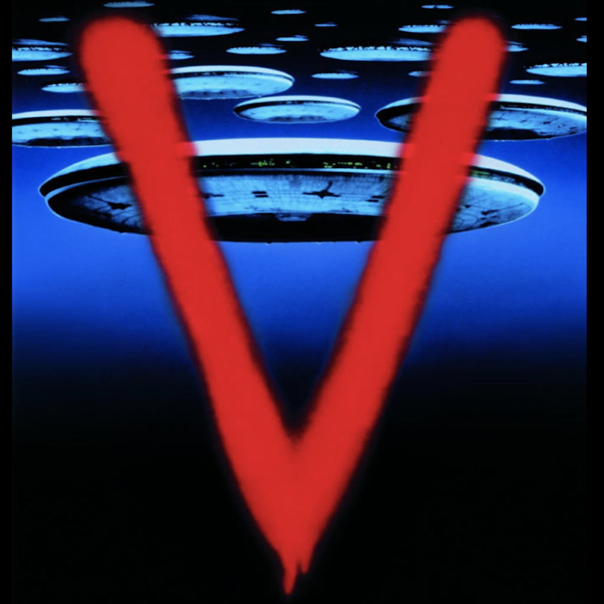
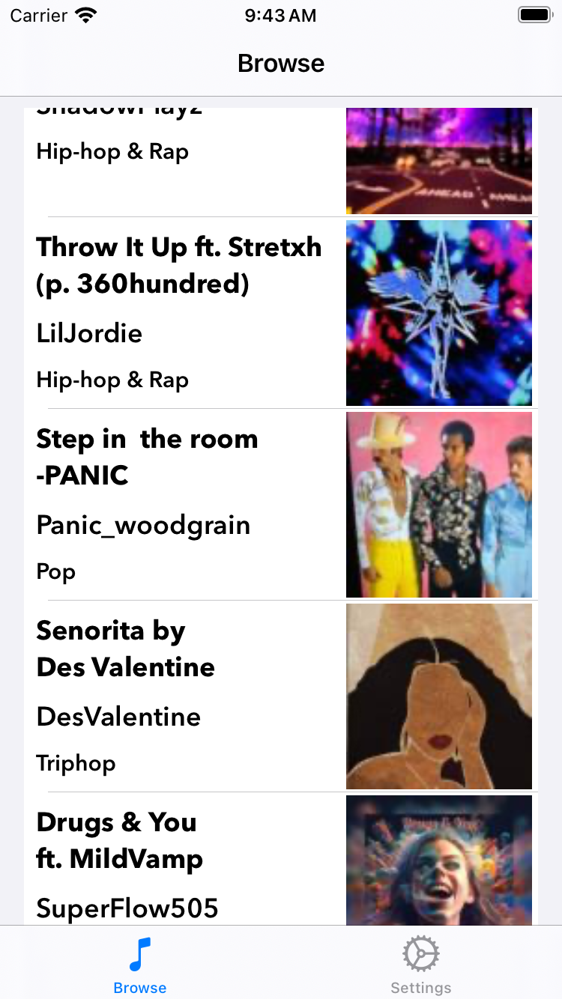

Voloco
===========

 

## Introduction

Voloco is an iOS app that demonstrates iOS-development techniques by allowing users to explore Resonant Cavity's hot-tracks API.

## Build Tools & Versions Used

I developed Voloco using Xcode 15.1, iOS 17.2, SwiftLint 0.52.3, and [this Voloco track](https://d29ppmbpobwnlj.cloudfront.net/3303461/posts/8093364e-88b4-42f7-b4b0-6832a55a248a/audio.m4a-n.m4a).

## Discussion

Voloco uses the MVCC architecture pattern, where the second C is "coordinator". I like coordinators because they take away from view controllers the job of in-app and out-of-app navigation, making view controllers easier to test and reason about.

In a more-complex app, I would use view models to mediate between views and models. View models can make complex views and view controllers easier to test and reason about. I did not include view models in Voloco because of the app's simplicity. 

The requirements did not call for unit tests, and, given time constraints, I did not implement any. That said, [unit](https://racecondition.software/blog/stubbing/) [testing](https://racecondition.software/blog/dependency-injection/) is [important](https://racecondition.software/blog/unit-testing/) to me. [Here](https://github.com/algoexpert-io/iOSExpert/tree/master/solution-wrap-up/CatFancy-final) is a fully unit-tested app I developed recently.

Voloco demonstrates two newer Swift features, `if let` [shorthand](https://github.com/apple/swift-evolution/blob/main/proposals/0345-if-let-shorthand.md) and `async`/`await` [concurrency](https://github.com/apple/swift-evolution/blob/main/proposals/0296-async-await.md).

In both [profes](https://apps.apple.com/us/app/capital-one-mobile/id407558537)[sional](https://itunes.apple.com/us/app/sfo-taxiq/id1096206222) and [side](https://github.com/vermont42/RaceRunner/blob/master/RaceRunner/UiConstants.swift)-[project](https://github.com/vermont42/Conjugar/blob/master/Conjugar/Colors.swift) apps, I use color palettes from designers or the website [Coolors](https://coolors.co). In Voloco, I relied on system-provided colors due to time constraints.

The tracks fit decently the dainty iPhone SE form factor. Some trak and user names don't fit in a `TrackCell`. `MarqueeLabel`, a `UILabel` [replacement](https://github.com/cbpowell/MarqueeLabel) that has performed [well](https://github.com/vermont42/RaceRunner/blob/master/RaceRunner/RunDetailsVC.swift#L29) in RaceRunner, would obviate the need for `String` truncation.

The requirements do not mention internationalization or localization so, in the interest of time, I did not wrap user-facing `String`s in `NSLocalizedString()`. I am, however, comfortable with that API.

## Screenshots

| Browsing | Details |
| -------- | ------- |
|  |  |

| Settings | Launch |
| -------- | ------- |
|  |  |

## Credits

The humorous badges at the top of this readme are from my [curated list](https://github.com/vermont42/Podcasts) of iOS-development podcasts.

The app icon is from the 1983 TV miniseries [V](https://en.wikipedia.org/wiki/V_(1983_miniseries)), which made a big impression on me.

Doug Suriano [shared](https://youtu.be/DmpoiN-SVds) the boilerplate-reduction technique in `NSLayoutConstraintExtension.swift`.

Antoine van der Lee [shared](https://www.avanderlee.com/swift/auto-layout-programmatically/) the boilerplate-reduction technique in `UsesAutoLayout.swift`.

Soroush Khanlou [developed](http://khanlou.com/2015/01/the-coordinator/) the coordinator pattern that Voloco uses for navigation. [Two](https://www.hackingwithswift.com/articles/71/how-to-use-the-coordinator-pattern-in-ios-apps) [posts](https://www.hackingwithswift.com/articles/175/advanced-coordinator-pattern-tutorial-ios) by Paul Hudson also informed Voloco's implementation.
